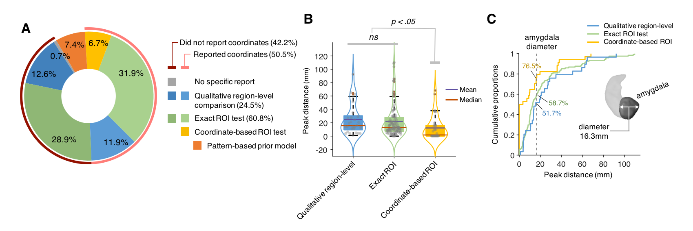
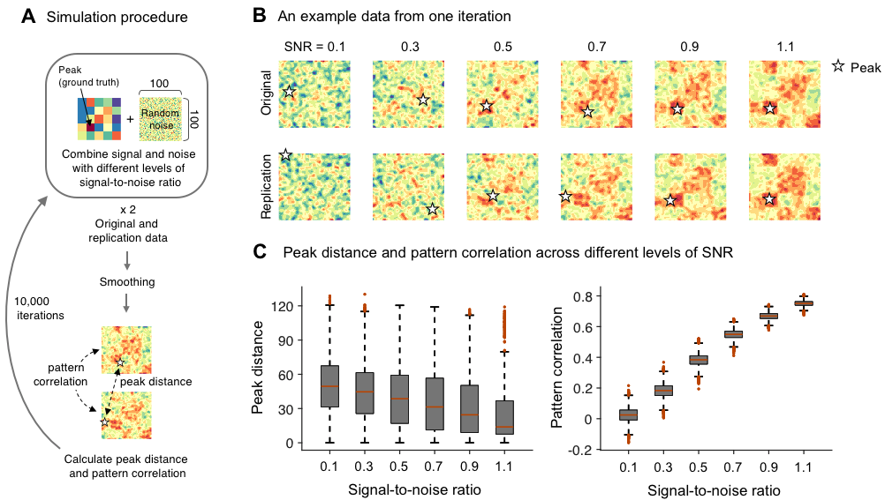
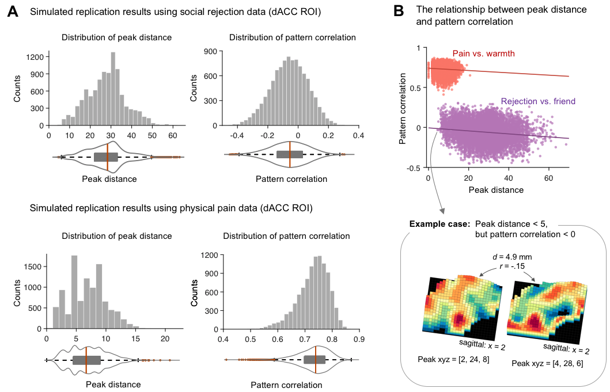
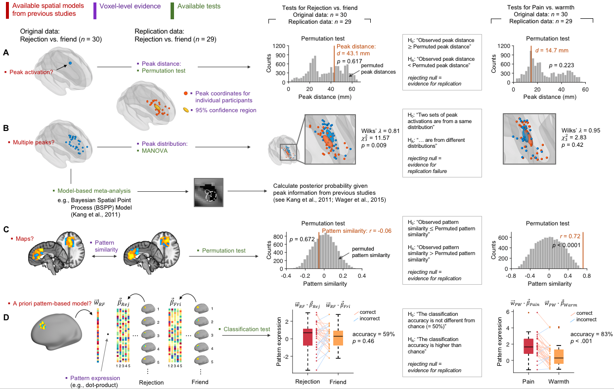

## Data and code sharing for Hong et al., in press

Through this github repository, we will share data and code that support "False-positive neuroimaging: Undisclosed flexibility in testing spatial hypotheses allows presenting anything as a replicated finding" upon its publication. 

You can access preprint manuscript from [here](https://www.biorxiv.org/content/10.1101/514521v1)
  
## Overview
Scripts are separated by function, not by figures. To better understand the script, we have tabulated the scripts needed for each figure, and we added the results of each figure.
  
## Figure composition

<table width=100%>
	<tr>
		<td width= 10%><b>Figure 1</b></td>
		<td>meta emotion maps.m</td>
		<td>example of issues in region level inference.m</td>
		<td>illustration 3bar original replication.m</td>
		<td></td>
		<td></td>
	</tr>
	<tr>
		<td><b>  Figure 2    </b></td>
		<td>survey pie chart.m</td>
		<td>survey result box violin plots.m</td>
		<td>cdfplot peak distances.m</td>
		<td></td>
		<td></td>
	</tr>
	<tr>
		<td><b>  Figure 3  </b></td>
		<td>peak pattern SNR sim.m</td>
		<td></td>
		<td></td>
		<td></td>
		<td></td>
	</tr>
	<tr>
		<td><b>  Figure 4  </b></td>
		<td>replication simulation scatter plot.m</td>
		<td>illustration 3bar original replication.m</td>
		<td></td>
		<td></td>
		<td></td>
	</tr>
	<tr>
		<td><b>  Figure 5  </b></td>
		<td>permutation test for single peak.m</td>
		<td>peaksconfidence region.m</td>
		<td>multiple peaks MANOVA.m4</td>
		<td>pattern similarity test.m</td>
		<td>classification test.m</td>
	</tr>
</table>

  
## Figure1: Issues in testing replication using region-level and coordinate-based spatial models. 

  

## Figure2: Survey results.

## Figure3: Simulation 1.

  

## Figure4: Simulation 2. 

  

## Figure5: Recommendations.

  

## Dependencies for the simulation code

- [Matlab](https://www.mathworks.com)

- CANLab core tools (e.g., voxel2mm.m, region.m, apply mask.m, etc.)

You can download the CANLab core tools using the following command line. 
	
	$ git_clone https://github.com/canlab/CanlabCore.git

- Cocoanlab core tools (e.g., glass brain network.m, boxplot wani 2016.m, roi contour map.m, etc.)

You can also download the COCOANlab core tools using the following command line. 
	
	$ git_clone https://github.com/cocoanlab/cocoanCORE.git

